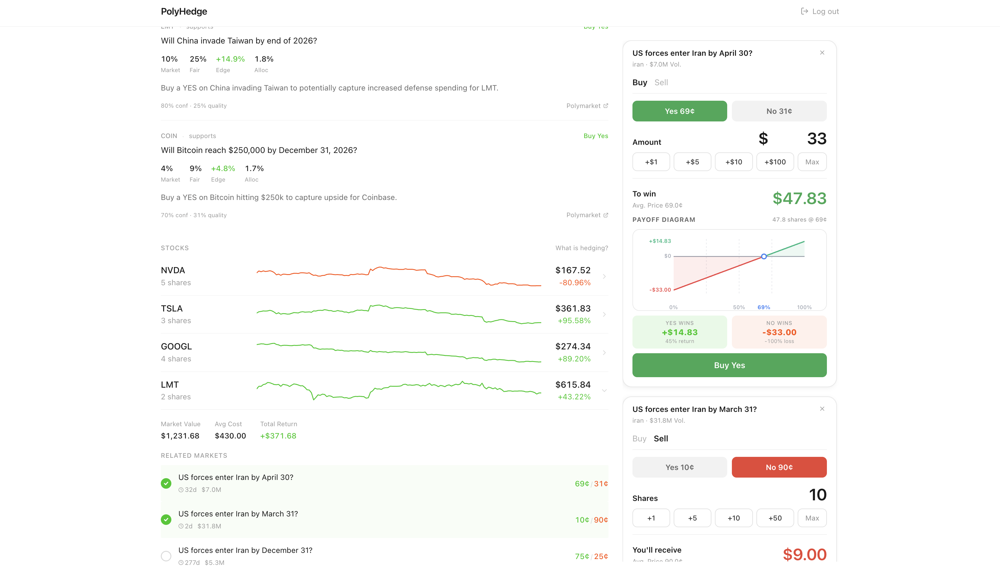
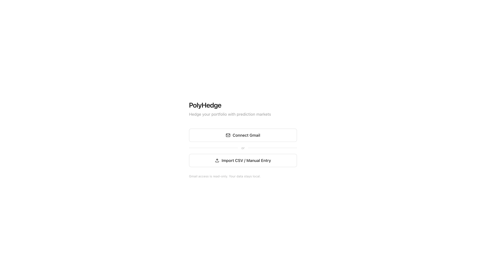
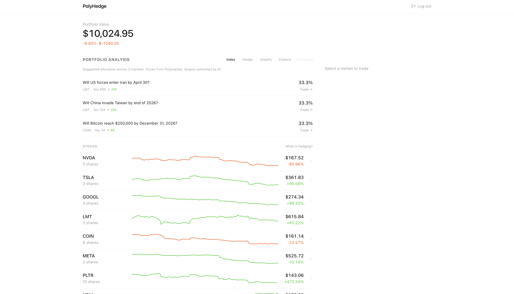

# PolyHedge

**[Watch the demo](https://www.youtube.com/watch?v=7Bpi9FOZCKk)**

[](https://www.youtube.com/watch?v=7Bpi9FOZCKk)

Hedge your stock portfolio using Polymarket prediction markets. Upload your holdings, get AI-powered analysis of relevant markets, and build a diversified prediction market index tailored to your positions.

The interface is modeled after Robinhood; the idea is that if you're already comfortable trading stocks there, prediction markets should feel just as familiar. Lower the barrier to entry for a new asset class.

### Portfolio Analysis & Trading
AI identifies themes across your holdings and surfaces relevant prediction markets. Trade directly through a Polymarket-style interface.



### Import Portfolio
Upload a CSV, enter positions manually, or connect Gmail to scan Robinhood confirmation emails.



### Index
Edge-weighted prediction market index with Kelly criterion sizing, showing current prices and AI-estimated targets.



## Setup

### 1. Backend

```bash
cd service-data
npm install
```

Create `service-data/.env`:

```
K2THINK_API_KEY=your_key
POLYMARKET_API_KEY=your_key
POLYMARKET_SECRET=your_secret
POLYMARKET_PASSPHRASE=your_passphrase
GOOGLE_CLIENT_ID=your_client_id
GOOGLE_CLIENT_SECRET=your_client_secret
```

Start the server:

```bash
npm run dev
```

Runs on `http://localhost:4000`.

### 2. Frontend

```bash
cd frontend
npm install
npm run build
```

The backend serves the built frontend. Open `http://localhost:4000`.

For development with hot reload:

```bash
npm run dev
```

Opens on `http://localhost:5173` (proxies API calls to :4000).

## Usage

1. Upload a CSV of your stock positions, enter them manually, or connect Gmail to scan Robinhood emails
2. PolyHedge fetches live prediction markets from Polymarket relevant to your holdings
3. K2Think AI analyzes relationships between your stocks and markets across three strategies: **hedge**, **amplify**, **explore**
4. The **index** tab generates a weighted portfolio of prediction market positions using Kelly criterion sizing
5. Click through to trade directly on Polymarket
